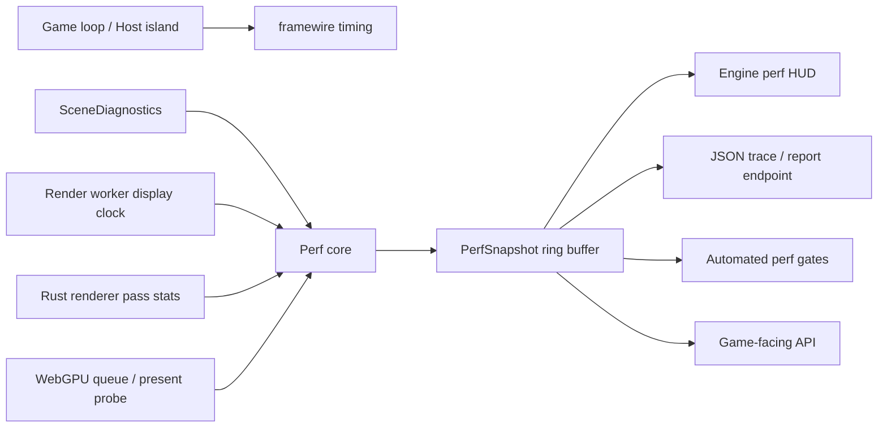

# voplay engine performance diagnostics final design

## 目标

voplay 需要一个引擎级、可长期维护的性能诊断体系。目标不是在 BK 里临时补几个计数器，而是在 voplay 内把慢帧发现、采样、归因、展示、导出、回归验收做成完整闭环。

最终目标：

- 120fps 目标下，单帧预算为 8.333ms；系统必须能稳定指出任何超过预算的帧由哪一层造成。
- 慢帧归因必须覆盖 game logic、draw encoding、framewire、render worker、Rust renderer CPU、WebGPU queue、present/backpressure、资源上传和 renderer workload。
- HUD 本身必须是高性能的引擎 HUD，不能成为新的慢帧来源。
- 诊断代码默认关闭时接近零成本；开启统计但不显示 HUD 时成本必须可量化；显示 HUD 时也必须有明确预算。
- BK 只消费 voplay 暴露的结构化性能快照。BK 不能继续维护一套重复且不完整的引擎性能判定体系。
- 诊断体系不能改变画质、阴影、物理、调度语义或游戏行为。性能优化可以后续基于数据执行，但诊断落地本身必须只增加观测能力。

## 当前代码 review

| 位置 | 当前状态 | 问题 |
| --- | --- | --- |
| `voplay/game.vo` | `GameCtx` 已有 overlay 字段，提供 `ShowDebugOverlayStats`、`HideDebugOverlay`、`DebugOverlayStats`。 | API 是游戏层入口，但数据模型是扁平 HUD 字段，不适合作为引擎诊断协议长期扩展。 |
| `voplay/debug_overlay.vo` | 有 240 样本 ring window，统计 game frame、logic、advance、draw、render loop、pace、reply、submit，并做慢帧分类。 | 分类只能看 host 和 render worker 的少量 timing，看不到 GPU queue、present backlog、pass workload、draw call、upload bytes；HUD 每次 draw 生成字符串，仍需纳入自身成本约束。 |
| `voplay/host.vo` | frame-driven loop 接收 render timing，记录 game/input/advance/draw/encode/reply timing。 | 逻辑岛边界有基础 timing，但没有统一 PerfFrame/PerfSnapshot，也没有将 scene diagnostics、renderer stats、GPU stats 合并到同一帧。 |
| `voplay/render_worker.vo` | render worker 拥有 display clock，记录 display pulse、pace wait、reply wait、submit、loop、draw bytes。 | 只能证明 JS worker loop 是否慢，无法判断 Rust renderer 内部 pass、GPU queue backlog、surface acquire/present 是否是慢点。 |
| `voplay/framewire/framewire.vo` | `Timing` 结构固定传递 render loop 指标，协议测试已存在。 | 协议没有 renderer workload/GPU queue 字段；后续必须用版本化扩展或独立诊断通道，避免破坏 framewire contract。 |
| `voplay/js/render_bootstrap.ts` | 已能 patch `GPUQueue.submit`、`GPUCanvasContext.getCurrentTexture`，采样 `onSubmittedWorkDone` 并向 `/__voplay_perf_report` 上报。 | 这是有价值的侦查能力，但当前是 JS 侧临时探针：数组排序、窗口报告、开关策略、与引擎 HUD 的数据合并都需要工程化。 |
| `voplay/rust/src/renderer.rs` | `Renderer.submit_frame` 覆盖 surface acquire、decoder、retained scene、depth、shadow、main、post、2D overlay、queue.submit、present；低频 debug 字符串已有 draw/model/primitive/sprite 等计数。 | 最关键的 renderer pass 只有 debug 字符串，没有结构化 per-pass CPU timing、draw call、triangle/instance、upload bytes、resource churn、shadow cascade 成本、post/overlay 成本。 |
| `voplay/rust/src/pipeline_depth.rs` | depth pass 可覆盖 model/skinned/instanced draw。 | 没有返回 depth pass workload 和 upload stats。 |
| `voplay/rust/src/pipeline_shadow.rs` | shadow pass/cascade pass 覆盖 model、primitive resident chunks。 | cascade 会放大 draw work，但没有结构化统计，无法解释 shadow 设置导致的 GPU backlog。 |
| `voplay/rust/src/pipeline3d.rs` | model/terrain/skinned/instanced batching、uniform write、texture bind group 都在这里。 | CPU batching、buffer write、bind group churn、draw calls 都是慢点候选，但没有统一计量。 |
| `voplay/rust/src/primitive_pipeline.rs` | transient/resident primitive batching、chunk rebuild、depth/shadow batches 都在这里。 | resident chunk rebuild、dynamic instance upload、primitive draw calls 没有按帧汇总到 renderer 诊断。 |
| `voplay/rust/src/pipeline2d.rs`、`pipeline_sprite.rs` | HUD/2D/sprite upload 与 draw 独立。 | 高性能 HUD 的自身成本必须从这里被看见，否则 HUD 可能污染慢帧判断。 |
| `voplay/scene3d/diagnostics.vo` | scene 层已有 `SceneDiagnostics`，包含 scene render stats、primitive stats、shadow/quality/debug mode。 | 这是引擎 perf snapshot 的重要 domain 输入，但目前没有和 render worker/Rust renderer/GPU queue 同帧合并。 |
| `BlockKart/performance_budget.vo` | BK 自己实现了 120fps budget analyzer、fixed-step profiler、慢帧分类、文本报告。 | 这是游戏层在弥补引擎诊断缺失。应迁移为 voplay engine diagnostic consumer，避免 BK 和引擎统计分叉。 |
| `BlockKart/theme.vo` | BK HUD 拷贝大量 perf 字段并绘制。 | HUD schema 绑定 BK，字段扩展困难；应改为读取 voplay 的 PerfSnapshot 或 HUD pages。 |

## 已知性能证据

此前 BK runner 的侦查数据显示：

- rAF/display pulse 窗口 p50 约 40ms，p90 约 50-52ms，p99 约 55-59ms。
- `getCurrentTexture` 和 `queue.submit` CPU 侧通常接近 0-0.1ms。
- `queue.onSubmittedWorkDone` p50 约 789-795ms，p90 约 812-838ms，p99/max 约 835-872ms，in-flight 约 3。

这个证据说明：只看 HUD FPS 或 host frame time 不够。CPU submit 很低不代表 GPU 没有排队；WebGPU queue backlog 很深时，表现会是“每隔一两秒卡一下”或 cadence 异常。最终诊断体系必须把 GPU queue/backpressure 作为一等公民。

## 最终架构



核心原则：

- 所有层写入同一套 `PerfFrame`，再由 `PerfCore` 聚合成 `PerfSnapshot`。
- 每个 sample 必须带 `frameId`、`displayTick`、`timestamp`、`source`。无法严格同帧对齐的数据必须标记为 `asyncWindow`，不能伪装成同帧数据。
- `PerfSnapshot` 使用固定容量 ring buffer，不在帧内分配，不在帧内排序。
- p50/p90/p99/max 使用增量 histogram 或固定 bucket 近似统计；只有导出报告时允许完整排序。
- HUD 读取已聚合快照，只做轻量绘制，不在 draw 中构造大量临时字符串。
- JS WebGPU probe 是引擎诊断输入之一，不是最终 HUD。HUD 主体由 voplay overlay/2D pipeline 绘制。

## 数据模型

### PerfFrame

每个 host/render/display frame 对齐到一个 `PerfFrame`：

| 字段 | 含义 |
| --- | --- |
| `frameId` | voplay 分配的递增帧号。 |
| `displayTick` | render worker display pulse tick。 |
| `targetHz` | 当前目标刷新率，例如 120。 |
| `budgetMs` | 当前帧预算，例如 8.333ms。 |
| `gameCpu` | input、advance、draw encode、overlay draw、reply encode。 |
| `framewire` | request decode、reply wait、reply encode、draw bytes。 |
| `renderWorker` | display pulse、pace wait、reply wait、submit CPU、loop total。 |
| `rendererCpu` | Rust submit frame、decode、scene update、pass CPU timings、queue submit CPU、present CPU。 |
| `rendererWorkload` | pass draw calls、instances、triangles/index count、upload bytes、bind group churn、resource creates/rebuilds。 |
| `gpuQueue` | submit count、in-flight count、onSubmittedWorkDone latency window、queue backlog class。 |
| `present` | surface acquire latency、present latency、lost/outdated surface events。 |
| `scene` | scene/model/primitive diagnostics snapshot。 |
| `hud` | HUD visible flag、HUD CPU cost、HUD draw workload。 |
| `classification` | 慢帧主因和次因。 |
| `spike` | 如果超过阈值，记录 spike 详情。 |

### PerfSnapshot

`PerfSnapshot` 是 HUD 和导出的唯一读取入口：

- 最近 N 帧 ring buffer，默认覆盖 10 秒：120fps 下 1200 帧。
- 1 秒、5 秒、30 秒窗口摘要。
- 当前帧、最近慢帧、最差帧。
- 各层 p50/p90/p99/max。
- 慢帧直方图：8.33ms、12ms、16.67ms、25ms、33.33ms、50ms、100ms+。
- 归因分布：CPU、GPU queue、present、pacing、resource churn、mixed。
- 采样开关状态和诊断开销。

### RendererWorkload

renderer workload 必须结构化，而不是 debug string：

| 类别 | 指标 |
| --- | --- |
| depth pass | draw calls、model draws、skinned draws、instanced batches、uploaded bytes、CPU ms。 |
| shadow pass | cascades、draw calls per cascade、primitive chunk draws、uploaded bytes、CPU ms。 |
| main pass | model/skinned/terrain/primitive/sprite draw calls、instances、texture bind group creates、CPU ms。 |
| post pass | enabled effects、render target size、CPU ms。 |
| overlay/2D pass | shape/sprite/text draw calls、instance uploads、HUD contribution、CPU ms。 |
| resources | buffer creates、texture uploads、bind group creates、resident chunk rebuilds、dynamic upload bytes。 |
| retained scene | scene upserts、removals、visible/culled counts、batch count。 |

### GpuQueueStats

WebGPU queue/backpressure 指标必须独立成块：

- `submitCpuMs`: JS/Rust submit call CPU cost。
- `submittedWorkDoneMs`: `queue.onSubmittedWorkDone` latency window。
- `inFlightSubmits`: 未完成 submit 数。
- `surfaceAcquireMs`: `getCurrentTexture`/surface acquire cost。
- `presentCpuMs`: present call CPU cost。
- `queueDepthClass`: `empty`、`normal`、`backlogged`、`saturated`。
- `sampleRate`: probe 采样率，默认按 submit 间隔采样，避免每帧 promise 压力。
- `probeOverheadMs`: probe 自身开销估计。

## 慢帧归因

慢帧分类必须基于证据，而不是单个 FPS 数字：

| 分类 | 判定依据 |
| --- | --- |
| `LOGIC_CPU_BOUND` | game advance/input/fixed-step 超预算，render/GPU 不排队。 |
| `DRAW_ENCODE_BOUND` | game draw encoding 或 overlay draw 超预算，draw bytes/commands 明显升高。 |
| `FRAMEWIRE_BOUND` | reply wait、encode/decode、draw bytes 传输异常。 |
| `RENDER_CPU_BOUND` | Rust submit frame、scene update、pass CPU 超预算，但 GPU queue 不深。 |
| `GPU_QUEUE_BOUND` | CPU submit 低，`onSubmittedWorkDone` 高，in-flight submit 持续升高。 |
| `PRESENT_BACKPRESSURE` | surface acquire/present 或 display pulse cadence 异常。 |
| `PACING_LIMITED` | pace wait/display pulse 主导，实际工作负载低。 |
| `RESOURCE_CHURN` | buffer/texture/bind group/chunk rebuild 激增，通常伴随 upload bytes 和 pass CPU 抖动。 |
| `HUD_OVERHEAD` | HUD visible 时 overlay/2D pass 或 text upload 明显增加。 |
| `MIXED` | 多个层同时超过阈值，记录主因和次因。 |

每个 spike 需要保存：

- spike frame id 和 wall time。
- 超预算多少 ms。
- 主因、次因、证据字段。
- 同帧 workload 摘要。
- 前后各 30 帧简化 timeline。

## 高性能 HUD

HUD 是 voplay 引擎 HUD，不是 BK 私有 HUD，也不是 DOM overlay。

### 显示模式

| 页面 | 内容 |
| --- | --- |
| Overview | 当前 FPS/cadence、frame budget bar、p50/p90/p99/max、slow-frame count、主因分布。 |
| Timeline | 最近 240 帧 frame time 条形图，按分类着色，标出 8.33ms/16.67ms/33.33ms 线。 |
| Workload | draw calls、instances、upload bytes、resource churn、shadow cascades、primitive chunks、2D/HUD 成本。 |
| GPU | queue backlog、onSubmittedWorkDone latency、in-flight submits、surface acquire/present、probe sample rate。 |
| Spike log | 最近慢帧列表，展示 frame id、ms、分类、证据。 |
| Scene | SceneDiagnostics 和 Primitive stats 的压缩视图。 |

### HUD 性能预算

| 状态 | 预算 |
| --- | --- |
| stats disabled | 不写 sample，不更新 HUD，接近零成本。 |
| stats enabled, HUD hidden | p99 额外 CPU < 0.05ms；固定 ring 写入，无 per-frame heap allocation。 |
| HUD visible | p99 额外 CPU < 0.20ms；不引入额外 render pass；text/labels 缓存；图表用固定顶点/实例缓冲。 |
| export/report | 可以在非帧路径做排序和 JSON 序列化，不能阻塞 render loop。 |

### HUD 实现要求

- 使用固定字符串槽位和数值格式缓存；数值变化超过阈值或刷新周期到达时才重新格式化。
- 图表使用固定容量 vertex/instance buffer；只更新必要范围。
- HUD 每页有固定 draw budget，超过时显示降采样后的数据，但必须保留慢帧 spike 记录。
- HUD 自身必须写入 `hud.cpuMs`、`hud.drawCalls`、`hud.uploadBytes`，用于发现诊断污染。
- 所有开关走 engine config：`off`、`stats`、`hud`、`trace`、`deep`。`deep` 才允许高成本 probe。

## 引擎 API

游戏侧 API 应该收敛为：

```text
Game.EnablePerfStats(mode)
Game.DisablePerfStats()
Game.TogglePerfHud()
Game.NextPerfHudPage()
Game.GetPerfSnapshot()
Game.MarkPerfScope(name)
Game.BeginPerfScope(name)
Game.EndPerfScope(handle)
```

BK fixed-step profiler 这类游戏特有信息应作为 custom scope/custom lane 注入 `PerfSnapshot`，不要复制引擎字段。

## 协议和集成

### framewire

短期保持现有 framewire render timing contract 稳定。新增 renderer/GPU 诊断走独立诊断消息或版本化 extension：

- `Timing` 保留现有字段，避免破坏 `tests/framewire_contract.vo`。
- 新增 `PerfPacket` 或 `DiagnosticsPacket`，用 optional section 携带 renderer workload/GPU stats。
- packet 必须有 schema version、frame id、source、payload byte length。
- 诊断 packet 可以按采样率发送，不能阻塞正常 render reply。

### Rust renderer

在 Rust 侧增加轻量 `RendererPerfCollector`：

- `begin_frame(frame_id)` / `end_frame()`
- `scope(RenderPassKind)` 记录 CPU timing。
- pipelines 返回 stats struct，不写字符串。
- resource managers 记录本帧 creates/writes/rebuilds。
- `Renderer.submit_frame` 汇总后交给 host/worker diagnostic channel。

需要改造的返回值：

- `pipeline_depth.render_depth_pass -> DepthPassStats`
- `pipeline_shadow.render_shadow_pass -> ShadowPassStats`
- `pipeline3d.draw_models -> MainPassModelStats`
- `primitive_pipeline.draw -> PrimitivePassStats`
- `pipeline2d.draw -> OverlayPassStats`
- `pipeline_sprite.draw -> SpritePassStats`

### JS/WebGPU probe

现有 `render_bootstrap.ts` probe 应被整理成引擎模块：

- 默认关闭，通过 engine perf mode、query/hash query param 或 localStorage 开启。
- 不在每个 frame 建 promise；按 submit 间隔或时间窗口采样。
- ring buffer 替代无限数组；窗口统计不在帧内排序。
- report endpoint 保留用于自动化和外部采集，但 HUD 读取 engine `PerfSnapshot`。
- report 中必须包含 probe overhead 和 sample rate，避免误读。

## 工作包

### 工作包 A：Perf core

- 新增 voplay engine `PerfFrame`、`PerfSnapshot`、ring buffer、window summary、spike recorder。
- 定义统一 budget：120fps = 8.333ms，同时支持按 display rate 动态预算。
- 实现固定 bucket histogram 和 top spikes。
- 将 `debug_overlay.vo` 的统计核心拆出，HUD 只读 snapshot。

### 工作包 B：跨岛 timing 对齐

- host/render worker/framewire 全部使用同一个 `frameId`。
- 合并 game timing、render worker timing、framewire timing。
- 保留现有 framewire tests，增加 PerfPacket contract tests。
- 所有异步来源标记 `asyncWindow`，避免错误同帧归因。

### 工作包 C：Renderer workload stats

- Rust renderer 每个 pass 返回结构化 stats。
- 统计 resource churn：buffer create/write、texture upload、bind group create、resident chunk rebuild。
- shadow cascade、primitive resident chunk、2D/HUD upload 必须单独可见。
- 低频 debug string 可以保留，但不能作为机器读取接口。

### 工作包 D：GPU queue/backpressure

- 工程化 WebGPU probe，纳入 engine perf mode。
- 采集 submit CPU、onSubmittedWorkDone、in-flight、surface acquire、present。
- 增加 queue backlog 分类。
- 将 prior BK runner 中发现的 queue backlog 模式作为回归用例。

### 工作包 E：Engine HUD

- 新 HUD pages：Overview、Timeline、Workload、GPU、Spike log、Scene。
- HUD 使用缓存字符串和固定图表 buffer。
- HUD 自身成本进入 snapshot。
- BK 删除私有 perf HUD 字段复制，改为 engine HUD 或 engine snapshot consumer。

### 工作包 F：导出和自动化

- `/__voplay_perf_report` 输出稳定 JSON schema。
- 支持 trace capture：最近 N 秒 snapshot + spikes + environment。
- 增加本地 perf smoke：打开 runner、采样 30 秒、输出 summary。
- 增加 perf gate：120fps budget、慢帧数、p99、GPU backlog 阈值。

## 验收标准

功能验收：

- 打开 BK runner 后，HUD 能同时显示 host timing、render worker timing、renderer workload、GPU queue 和 scene stats。
- 任意慢帧都能在 spike log 中看到 frame id、耗时、主因、证据字段。
- 当 GPU queue backlog 出现时，分类必须明确显示 `GPU_QUEUE_BOUND`，不能误判为单纯 HUD FPS 低。
- 当 HUD 开启导致 overlay/2D 成本升高时，分类必须能显示 `HUD_OVERHEAD`。
- BK 不再维护重复的引擎慢帧分类逻辑，只保留游戏自定义 scope。

性能验收：

- stats disabled：无可观测帧率损失。
- stats enabled, HUD hidden：p99 额外 CPU < 0.05ms。
- HUD visible：p99 额外 CPU < 0.20ms。
- 30 秒采样期间没有因诊断产生的 heap growth。
- 120fps 预算下，自动报告必须输出 p50/p90/p99/max、慢帧数量、最差 10 帧、主因分布。

可维护性验收：

- 所有新增 packet/schema 有 contract tests。
- 每个 renderer pass stats 都有独立 struct 和汇总测试。
- HUD 不直接依赖 BK 字段。
- 文档、schema、HUD 页面、导出 JSON 使用同一套字段命名。
- 任意新增 renderer pass 必须补充 `RendererWorkload` 字段或显式标记为 untracked。

## BK 迁移结果

BK 最终只需要：

- 在开发模式启用 `Game.EnablePerfStats("hud")`。
- 把 fixed-step、kart physics、world update 这类游戏特有耗时写入 custom scopes。
- 删除 BK 私有引擎性能分类和大量 HUD 字段复制。
- 保留面向玩法调试的文本，但来源是 `Game.GetPerfSnapshot()`。

这样 BK 的性能问题会被 engine 统一回答：是逻辑、draw encoding、framewire、renderer CPU、GPU queue、present、resource churn、HUD overhead，还是混合问题。优化工作必须基于这个 snapshot 再执行，避免继续靠肉眼 FPS 和猜测改代码。

## 本轮实现落地状态

设计 review 后，本轮实现已把诊断体系从旧的 `DebugOverlayStats` 扁平字段推进为引擎级结构化入口：

- `voplay/perf_diagnostics.vo` 新增 `PerfFrame`、`PerfSnapshot`、固定容量 ring sample、窗口摘要、慢帧归因、spike cache、HUD overhead 字段和 `Game.EnablePerfStats(mode)` / `DisablePerfStats()` / `TogglePerfHud()` / `NextPerfHudPage()` / `GetPerfSnapshot()` API。
- 自动化入口已补齐：`Game.GetPerfTrace(maxFrames)` 导出最近帧、spike、窗口摘要和 overhead；`Game.EvaluatePerfGate(config)` / `voplay.EvaluatePerfGate(snapshot, config)` 用统一阈值检查 120fps 慢帧、p99/max、GPU queue、HUD overhead 和 probe overhead。
- `debug_overlay.vo` 保留旧 API 兼容，但 HUD 现在通过 engine snapshot 绘制 Overview、Timeline、Workload、GPU、Spike log、Scene 页面。
- `host.vo` 在 perf disabled 时不再更新 overlay/sample/HUD，避免默认路径持续产生诊断成本。
- `framewire/framewire.vo` 保持 `Timing` contract 不变，并新增独立版本化 `PerfPacket` schema；`tests/framewire_contract.vo` 覆盖 raw payload 兼容和 packet 字段往返。
- `js/render_bootstrap.ts` 的 WebGPU probe 默认关闭，只在 `voplayPerf` / `perf` query/hash query param 或 `localStorage["voplay.perf.mode"]` 开启；报告 JSON 带 schema version、mode、sample rate、queue depth class、probe CPU overhead 和稳定历史 ring。
- `tools/perf_gate.mjs` 可读取 `/__voplay_perf_report` endpoint JSON、URL、JSON/JSONL 或 stdin，输出 pulse/WebGPU summary，并按阈值作为 CI gate 返回 0/1。

当前真实数据接入边界：

- host/game CPU、draw encode、overlay HUD CPU、render worker loop/pace/reply/submit、draw bytes 和 submit bytes 已进入 snapshot。
- Rust renderer 现在在 perf enabled 时采集并发回版本化 renderer `PerfPacket`：surface acquire、submit frame、decode、scene update、depth/shadow/main/post/overlay pass、queue submit、present CPU timing，以及 draw/model/skinned/primitive/sprite/text、instance、triangle、upload、resident chunk rebuild、shadow cascade、post effects、retained scene churn、visible/cull 等 workload 字段。
- `render_worker.vo` 会把 renderer packet 和 WebGPU packet 作为 framewire request tail 发回 host；`host.vo` 合并后进入 `PerfSnapshot.RendererCpu`、`RendererWorkload`、`GpuQueue`、`Present` 和 HUD 页面。packet tail 是 optional section，旧 request/input contract 不变，`tests/framewire_contract.vo` 覆盖单 packet 和多 packet 往返。
- `js/render_bootstrap.ts` 的 WebGPU probe 现在除了 `/__voplay_perf_report` stable JSON 外，还会编码 `PerfPacketSourceWebGpu` packet，经 `lastWebGpuPerfPacket()` 进入 Vo snapshot；queue depth class 为 `backlogged`/`saturated` 时，慢帧归因会明确落到 `GPU_QUEUE_BOUND`。
- 默认 perf disabled 时，host 不记录 overlay，render worker 不读取/发送 packet，renderer 关闭 packet collector 并清空 last packet；WebGPU probe 仍默认关闭，只保留一个空 packet bridge 函数，避免默认路径持续产生诊断成本。
